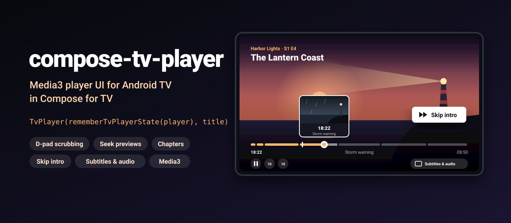
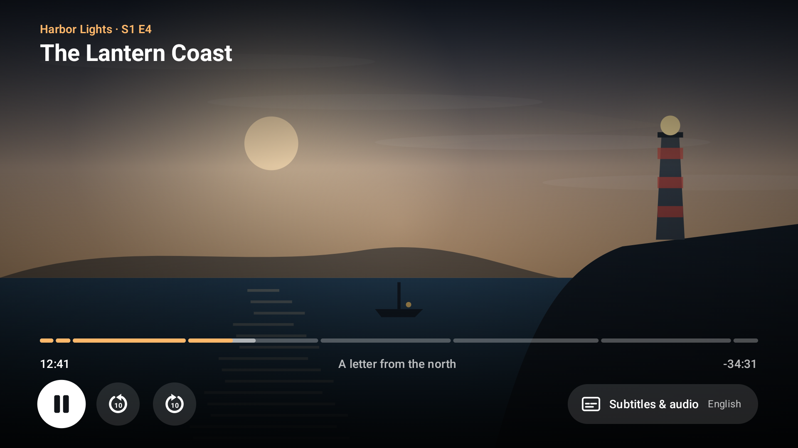
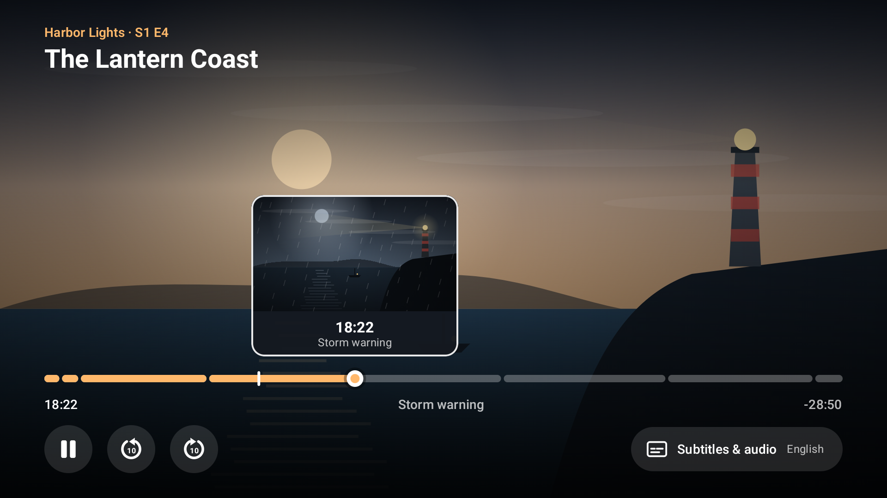
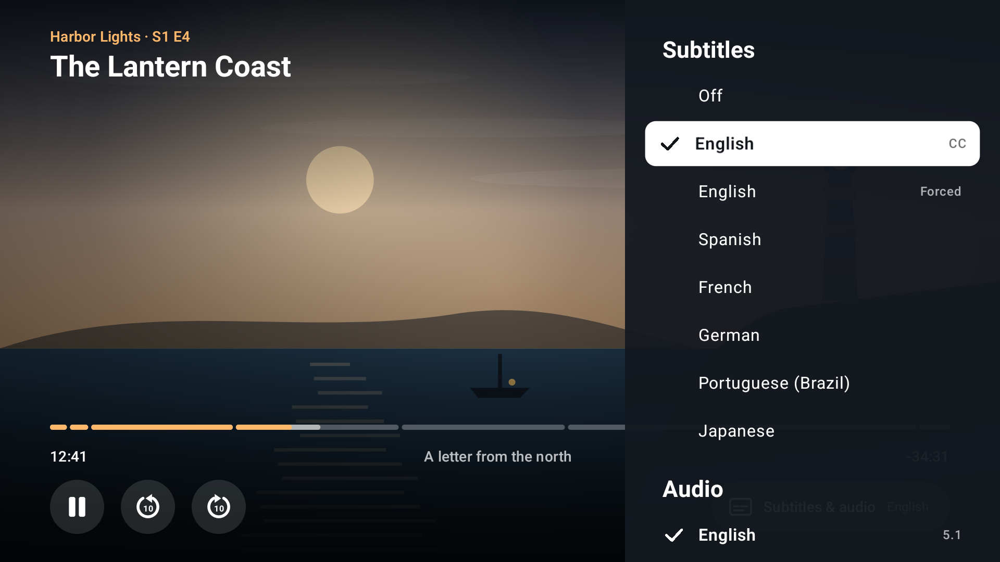

<p align="center">
  
</p>

<p align="center">
  <a href="https://github.com/halilozel1903/compose-tv-player/actions/workflows/ci.yml"></a>
  <a href="https://jitpack.io/#halilozel1903/compose-tv-player"></a>
  
  
  
  
  
  <a href="LICENSE"></a>
</p>

**compose-tv-player** is the player screen of a streaming app for Android TV, built with Compose for TV on top of Media3. It gives you D-pad scrubbing that speeds up while you hold the key, a seek preview bubble with thumbnails, a chaptered seek bar that stops on chapter starts, a skip intro button that takes the focus when the intro starts, and a side panel to pick subtitles and audio. Controls hide on their own while playing and come back on any key. The timing and menu logic lives in a plain Kotlin module with unit tests.

```kotlin
val player = remember { ExoPlayer.Builder(context).build() }
val state = rememberTvPlayerState(player, chapters = chapters, skipWindows = skipWindows)

TvPlayer(state, title = "The Lantern Coast", subtitle = "Harbor Lights · S1 E4", thumbnails = storyboard)
```

## Screenshots

Captured from the sample app on an Android TV emulator (1080p) by CI. The sample plays no real video here: a fake player engine runs over generated frames.

| Playing | Scrubbing with a seek preview |
| :---: | :---: |
|  |  |
| **Skip intro** | **Subtitles and audio** |
|  |  |

## Why

Media3's `PlayerView` comes with a touch controller that is awkward on a TV remote, and Compose for TV has no player at all. A good TV player needs more than a play button: the seek bar must react to `Left` and `Right` with steps that grow while the key is held, show where you will land before you commit, respect chapters, give the focus to "Skip intro" at the right moment and give it back afterwards, list subtitle languages with readable names, and hide itself without hiding while you are still choosing something. compose-tv-player wires this together on top of any Media3 `Player`, and keeps the rules in `compose-tv-player-core`, a pure Kotlin module with 51 unit tests.

## Features

- **`TvPlayer(state, title)`**: the whole screen, a Media3 `PlayerView` (video and subtitles, no built-in controller) under the Compose controls.
- **`TvPlayerControls`**: the overlay alone, over your own video surface. Title and series line on top; seek bar, times, current chapter and buttons at the bottom; gradients so text stays readable.
- **D-pad scrubbing**: `Left` / `Right` on the focused seek bar move a preview, not the playhead. Holding the key accelerates (10 s, 20 s, 30 s, 1 min, 2 min, never more than 5% of the media). Center or a short pause commits the seek, Back cancels it.
- **Seek preview bubble**: the previewed time, its chapter and a thumbnail from your `SeekThumbnailProvider`, kept above the right point of the bar. `SpriteSheetThumbnailProvider` cuts frames from a trick play storyboard.
- **Chapters**: the bar is split into segments at chapter starts, and a scrub that lands close to a chapter start stops exactly on it.
- **Skip intro, recap and credits**: `SkipWindow`s show a button that takes the focus when its window starts, hides near the end, and gives the focus back when it goes. Optional "only for the first 10 seconds unless the controls are up" rule.
- **Subtitles and audio panel**: languages as readable names (`"pt-BR"` → "Portuguese (Brazil)"), "Off" for subtitles, `CC` and `Forced` tags, `5.1` / `Stereo` for audio, duplicates numbered. Selecting a row applies a Media3 `TrackSelectionOverride`.
- **Auto-hide**: controls hide after 5 seconds while playing, stay up while paused, scrubbing or choosing a track, and any key brings them back (`Left` / `Right` start a scrub right away).
- **TV focus done right**: `FocusRequester`s for every control, a `focusRestorer` on the button row, a focus trap in the side panel, and the `PlayerView` blocked from taking focus.
- **Remote keys**: play/pause, play, pause, rewind and fast forward media keys; Back closes the panel, cancels a scrub, then hides the controls.
- **`PlayerEngine`**: the player behind a small interface. `Media3PlayerEngine` wraps any Media3 `Player`; `FakePlayerEngine` drives previews, UI tests and screenshots without video.
- **Pure Kotlin core** (`compose-tv-player-core`): `TimeFormat`, `Timeline`, `SeekAcceleration`, `Scrubber`, `Chapters`, `SkipRules`, `TrackMenu`, `ControlsState` and `ThumbnailGrid`, unit tested.

## Installation

Add JitPack to `settings.gradle.kts`:

```kotlin
dependencyResolutionManagement {
    repositories {
        google()
        mavenCentral()
        maven("https://jitpack.io")
    }
}
```

Then the dependency, plus the Media3 player you use:

```kotlin
dependencies {
    implementation("com.github.halilozel1903.compose-tv-player:compose-tv-player:1.0.0")
    implementation("androidx.media3:media3-exoplayer:1.8.0")
    // Pure Kotlin timing, chapter, skip and track menu logic only (for JVM/KMP modules):
    // implementation("com.github.halilozel1903.compose-tv-player:compose-tv-player-core:1.0.0")
}
```

The library brings `androidx.tv:tv-material` 1.1.0 and `androidx.media3:media3-common` 1.8.0 as `api` dependencies and `media3-ui` for `PlayerView`. Your app's manifest should declare it runs on TV:

```xml
<uses-feature android:name="android.software.leanback" android:required="false" />
<uses-feature android:name="android.hardware.touchscreen" android:required="false" />

<application android:banner="@drawable/banner" ...>
    <activity android:name=".PlayerActivity" android:exported="true">
        <intent-filter>
            <action android:name="android.intent.action.MAIN" />
            <category android:name="android.intent.category.LEANBACK_LAUNCHER" />
        </intent-filter>
    </activity>
</application>
```

> The build is also set up for Maven Central (`io.github.halilozel1903:compose-tv-player`) via the vanniktech publish plugin.

## Usage

**A player screen**

```kotlin
@Composable
fun PlayerScreen(url: String) {
    val context = LocalContext.current
    val player = remember {
        ExoPlayer.Builder(context).build().apply {
            setMediaItem(MediaItem.fromUri(url))
            prepare()
            playWhenReady = true
        }
    }
    DisposableEffect(player) { onDispose { player.release() } }

    val state = rememberTvPlayerState(
        player = player,
        chapters = listOf(
            Chapter("Previously", 0),
            Chapter("Opening titles", 58_000),
            Chapter("Storm warning", 1_102_000),
            Chapter("Credits", 2_730_000),
        ),
        skipWindows = listOf(
            SkipWindow(SkipKind.Recap, startMillis = 0, endMillis = 58_000),
            SkipWindow(SkipKind.Intro, startMillis = 58_000, endMillis = 125_000),
            SkipWindow(SkipKind.Credits, startMillis = 2_730_000, endMillis = 2_832_000, label = "Next episode"),
        ),
    )
    TvPlayer(state, title = "The Lantern Coast", subtitle = "Harbor Lights · S1 E4", modifier = Modifier.fillMaxSize())
}
```

**Seek preview thumbnails**

```kotlin
// From a storyboard sprite sheet: 10 x 10 tiles, one every 10 seconds.
val thumbnails = SpriteSheetThumbnailProvider(sheet = storyboardBitmap, grid = ThumbnailGrid(columns = 10, rows = 10, intervalMillis = 10_000))

// Or anything composable, for example an image loader.
val thumbnails = SeekThumbnailProvider { position -> AsyncImage(model = thumbnailUrl(position), contentDescription = null) }

TvPlayer(state, title, thumbnails = thumbnails)
```

**Tuning**

```kotlin
val state = rememberTvPlayerState(
    player = player,
    config = TvPlayerConfig(
        autoHideMillis = 4_000,               // null keeps the controls up
        scrubCommitDelayMillis = 1_500,       // null waits for the center button
        seekStepMillis = 15_000,              // rewind and forward buttons
        acceleration = SeekAcceleration(baseStepMillis = 5_000, repeatsPerLevel = 10),
        chapterSnapMillis = 6_000,            // 0 disables snapping
        skipRules = SkipRules(standaloneMillis = null),
    ),
)
```

**Your own video surface or controls**

```kotlin
Box(Modifier.fillMaxSize()) {
    MyVideoSurface(player)
    TvPlayerControls(state, title = "The Lantern Coast", thumbnails = thumbnails)
}

// Or build your own overlay from the pieces:
TvSeekBar(state, Modifier.fillMaxWidth())
SkipButton(window, onClick = { state.skip(window) })
TrackSelectionPanel(state)
```

**Programmatic control**

```kotlin
state.togglePlayPause()
state.seekBy(-10_000)
state.scrub(SeekDirection.Forward)          // as one D-pad press on the seek bar
state.openTrackPanel()
state.requestFocus(PlayerFocusTarget.SeekBar)
```

**Translations**

```kotlin
TvPlayer(
    state, title,
    labels = TvPlayerLabels(
        skipIntro = "Girişi atla",
        subtitles = "Altyazılar",
        trackMenu = TrackMenu.Labels(off = "Kapalı"),
        displayLocale = Locale.forLanguageTag("tr"),
    ),
)
```

## API

| `TvPlayerState` | What it does |
| --- | --- |
| `snapshot` | Position, duration, buffered position, playing, buffering and tracks, refreshed every 250 ms and on player events |
| `controlsVisible`, `showControls()`, `hideControls()` | The auto-hide state |
| `scrub(direction, repeatCount)`, `scrubTo(position)`, `commitScrub()`, `cancelScrub()` | The seek preview; `scrub` and `displayPositionMillis` while it runs |
| `currentChapter`, `chapters` | The chapter at the shown position |
| `visibleSkipWindow`, `skip()` | The skip button |
| `isTrackPanelOpen`, `openTrackPanel()`, `selectTrack(item)` | The subtitle and audio panel |
| `play()`, `pause()`, `togglePlayPause()`, `seekTo()`, `seekBy()` | Playback |
| `requestFocus(target)`, `handleBack()` | Focus and Back |

| Core | What it does |
| --- | --- |
| `TimeFormat.clock / remaining / progress / spoken` | `"42:07"`, `"1:02:03"`, `"-34:31"`, `"12:41 / 47:12"`, `"12 minutes 41 seconds"` |
| `Timeline.fraction / bufferedFraction / positionAt / seekBy` | Seek bar math that survives an unknown duration |
| `SeekAcceleration.stepFor(repeatCount, duration)` | The step of one D-pad key event |
| `Scrubber(duration, chapters).step(state, direction, repeatCount)` | A scrub as an immutable `ScrubState`, with chapter snapping |
| `Chapters.chapterAt / next / previous / markerFractions` | Chapter lookups |
| `SkipRules.visibleWindow(windows, position, controlsVisible)` | When the skip button shows |
| `TrackMenu.subtitles / audio / languageName` | Menu rows with readable names |
| `ControlsState.reduce(event)` | The auto-hide state machine |
| `ThumbnailGrid.tileAt(position)` | Storyboard tile lookup |

## How it works

```text
any key, controls hidden -> shown (Left/Right also start a scrub on the seek bar)
Left/Right on seek bar   -> Scrubber.step(repeatCount)  -> preview + bubble, playhead untouched
                            center or 1.2 s idle         -> engine.seekTo(preview)
every 250 ms             -> engine.snapshot()            -> ControlsState.reduce(Tick) -> auto-hide
skip window starts       -> SkipButton composed          -> FocusRequester.requestFocus()
panel row clicked        -> TrackSelectionOverride       -> Media3 switches the track
Back                     -> close panel > cancel scrub > hide controls > leave the screen
```

```kotlin
val scrubber = Scrubber(durationMillis = 2_832_000, chapters = Chapters(chapters))
var scrub = scrubber.start(positionMillis = 1_090_000)
scrub = scrubber.step(scrub, SeekDirection.Forward)   // 1_102_000, not 1_100_000: stopped on "Storm warning"
```

## Sample app

The `sample` module is "Driftwood", a fictional streaming app for Android TV (it also installs on phones). Without extras it streams a public sample video ("Big Buck Bunny", Blender Foundation, CC BY 3.0) with ExoPlayer. The screenshot scenes play a made-up episode on a `FakePlayerEngine` over a coast drawn with Compose gradients and shapes, so there are no copyrighted images, no video files and no network:

```bash
./gradlew :sample:installDebug
adb shell am start -n io.github.halilozel1903.tvplayer.sample/.MainActivity --es scene scrubbing
```

`scene` is one of `playing`, `scrubbing` (preview bubble on "Storm warning"), `skipintro` ("Skip intro" focused) or `tracks` (subtitle panel open).

## Project structure

| Module | What it is |
| --- | --- |
| `tvplayer-core` | Pure Kotlin: time formatting, seek math and acceleration, chapters, skip windows, track menus, the controls state machine. Published as `compose-tv-player-core` |
| `tvplayer` | Compose for TV and Media3: `TvPlayer`, `TvPlayerControls`, `TvSeekBar`, `SeekPreviewBubble`, `SkipButton`, `TrackSelectionPanel`, `TvPlayerState`, `PlayerEngine`. Published as `compose-tv-player` |
| `sample` | An Android TV player with generated frames and screenshot scenes |

## Tech stack

Kotlin 2.4 · AGP 9.4 with built-in Kotlin · Gradle 9.6 · Jetpack Compose (BOM 2026.09) · Compose for TV (`androidx.tv:tv-material` 1.1.0) · AndroidX Media3 1.8 (ExoPlayer, `PlayerView`) · GitHub Actions with an Android TV emulator

## License

MIT. See [LICENSE](LICENSE).
